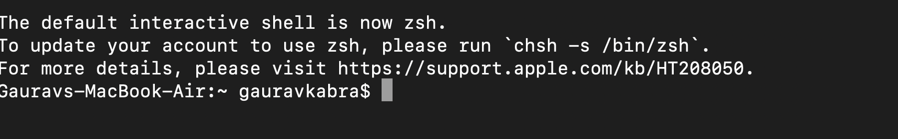
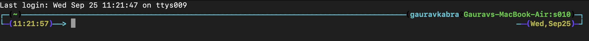
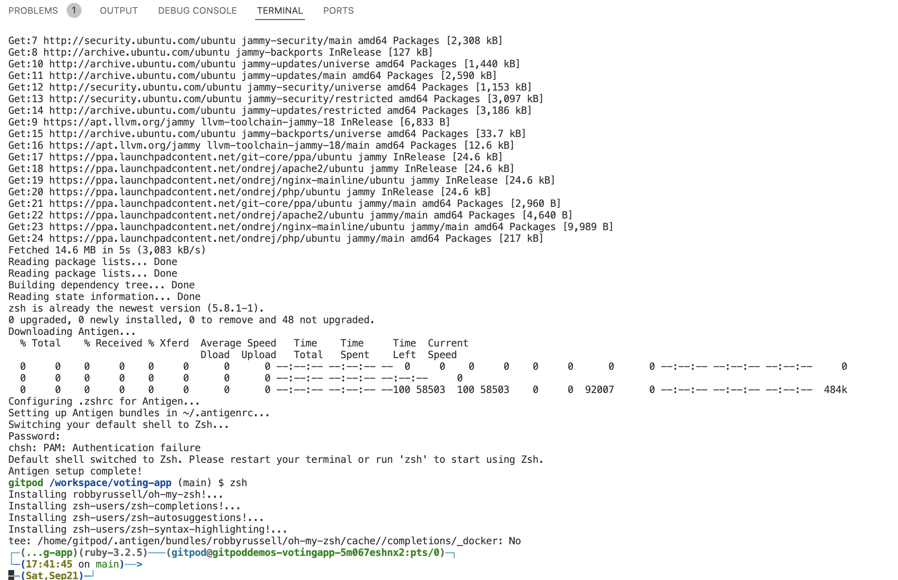

# DOTFILES

by Gaurav Kabra

Make you boring terminal amazing 💥!



TO....



# How To Install

---

If you don't want to clone this repo:
```
bash <(curl -s https://raw.githubusercontent.com/kabragaurav/dotfiles/master/install.sh)
```

---

Otherwise
Clone the repo and `cd` to it. Then execute:

```
chmod +x install.sh
./install.sh
chsh -s /bin/zsh
```


Script achieves terminal setup mentioned as <a href="https://levelup.gitconnected.com/zsh-antigen-oh-my-zsh-a-beautiful-powerful-robust-shell-ca5873821671">Zsh + Antigen + Oh my Zsh = A Beautiful, Powerful, and Robust Shell</a>


# Well Tested
Tested on Gitpod:



And on local as well.

# How To Uninstall

---

If you don't want to clone this repo:
```
bash <(curl -s https://raw.githubusercontent.com/kabragaurav/dotfiles/master/uninstall.sh)
```

---

Otherwise
Clone the repo and `cd` to it. Then execute:

```
chmod +x uninstall.sh
./uninstall.sh
```

Note that for changes to be reflected, you may need to relaunch your terminal or open a new terminal tab.