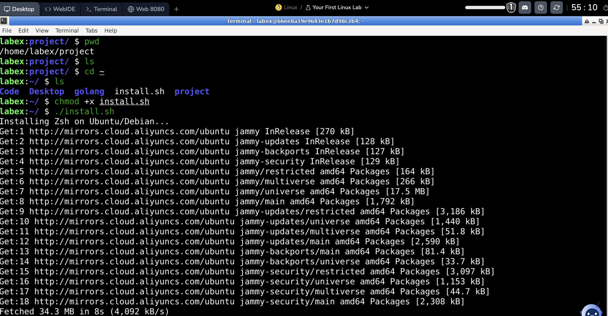
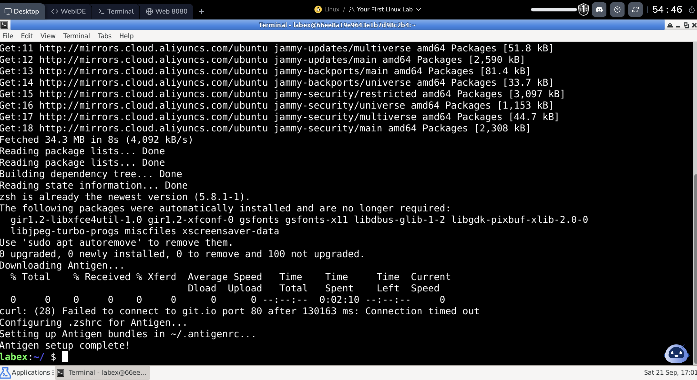

# DOTFILES

by Gaurav Kabra

# How To Install

---

If you don't want to clone this repo:
```
bash <(curl -s https://raw.githubusercontent.com/kabragaurav/dotfiles/master/install.sh)
```

---

Otherwise
Clone the repo and `cd` to it.

```
chmod +x install.sh
./install.sh
```


Script achieves terminal setup <a href="https://levelup.gitconnected.com/zsh-antigen-oh-my-zsh-a-beautiful-powerful-robust-shell-ca5873821671">Zsh + Antigen + Oh my Zsh = A Beautiful, Powerful, and Robust Shell</a>


Tested script on <a href="https://labex.io/tutorials/linux-online-linux-playground-372915">Labex</a>.

Request timed out but script looks good.



